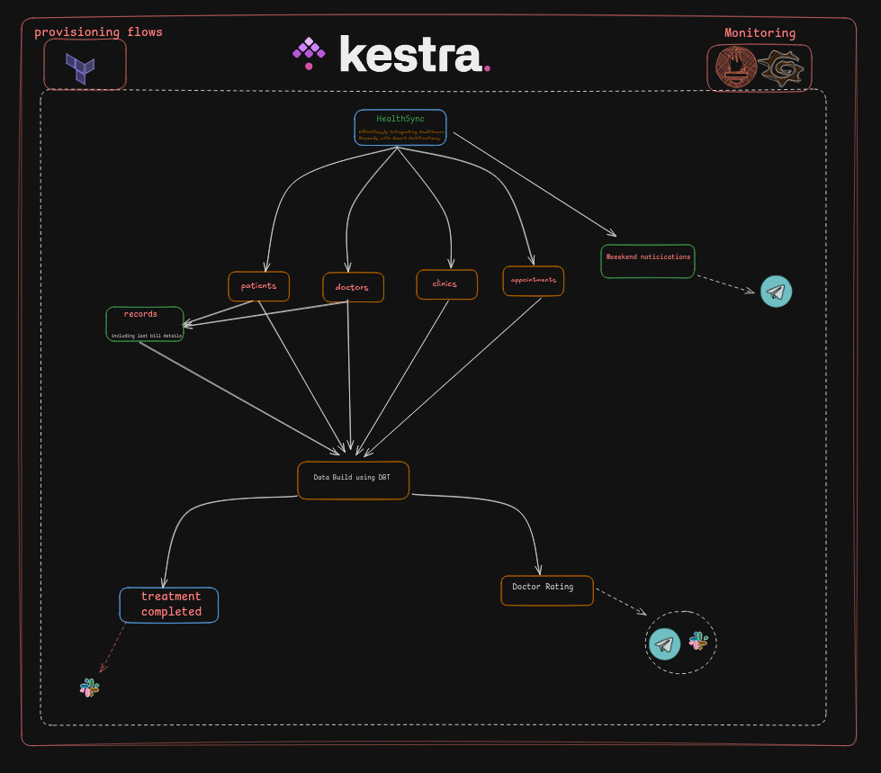
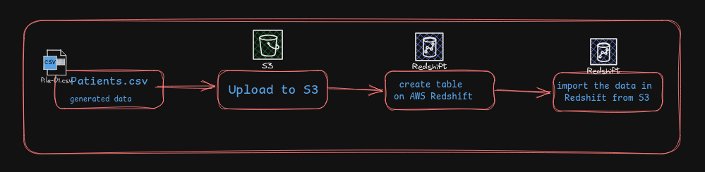
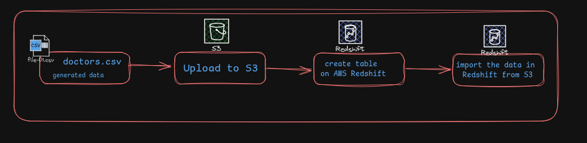
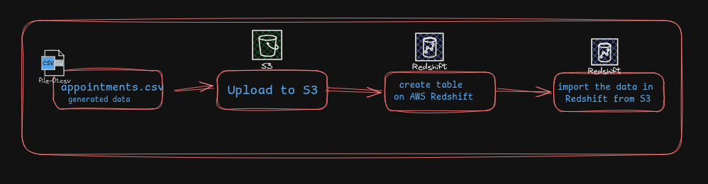
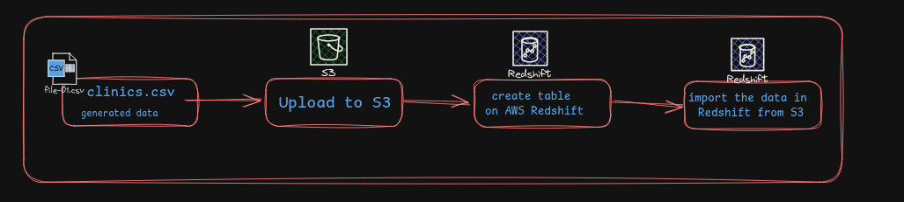
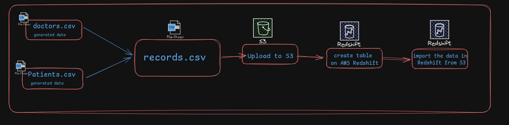

# Health Synth

[#Hackfrost2024](https://x.com/Rishavmehraa/status/1862920253963170028) Hackathon Project, sponsored  by [kestra](https://kestra.io/) and organised  by [wemakedevs](https://www.wemakedevs.org/)

Health Synth is a platform designed to address key challenges in healthcare, such as fragmented data, delayed communication, lack of feedback, and underutilized data. It unifies healthcare information (patients, doctors, clinics, appointments) into a single system for easy access. Automated notifications keep everyone informed in real-time, reducing missed appointments and ensuring coordinated care. A feedback module allows patients to rate doctors, promoting transparency and service improvement. Additionally, it utilizes healthcare data for better insights and predictive analytics.

---

**Live links:** <br/> 
- Kestra Dashboard ->            <u> [Live Kestra](http://65.0.134.199:8080/)</u>
- Grafana Dashboard for Kestra -> <u>[Grafana](http://65.0.134.199:3000/)</u>
- Demo video: 
- Notion Docs: [Notion](https://rishavmehra.notion.site/Health-Synth-143da50ecaba80f4a99ee13b8d05f9d1?pvs=4)

---

**Technology Stack:**
- **kestra:** Workflow Automation Platform for orchestrating workflows.
- **AWS:**
    - **S3:** Used for storing objects and files.
    - **Redshift:** Data warehousing solution for analytics and querying.
    - **EC2:** Hosts the project
- **Golang:** Used for the application development.
- **Python:** Utilized for data processing with `pandas` and generating plots with `matplotlib`.
- **DBT:** Used for transforming data in the data warehouse and managing data models.
- **Slack webhooks:** Used for sending notifications to Slack channels.
- **Telegram api:** Sends notifications to end users via Telegram.
- **Promotheus:** Used for monitoring Kestra flows and collecting metrics.
- **Grafana:** Visualizes the metrics collected by Prometheus for monitoring and analysis.

---
**KESTRA FLOW DESIGN:**



---
**Kestra Plugins used in this project:**
 - [io.kestra.plugin.core.condition.ExecutionStatusCondition](https://kestra.io/plugins/core/conditions/io.kestra.plugin.core.condition.executionstatuscondition)
 - [io.kestra.plugin.notifications.slack.SlackIncomingWebhook](https://kestra.io/plugins/plugin-notifications/tasks/slack/io.kestra.plugin.notifications.slack.slackincomingwebhook)
 - [io.kestra.plugin.core.condition.ExecutionFlowCondition](https://kestra.io/plugins/core/conditions/io.kestra.plugin.core.condition.executionflowcondition)
 - [io.kestra.plugin.notifications.telegram.TelegramSend](https://kestra.io/plugins/plugin-notifications/tasks/telegram/io.kestra.plugin.notifications.telegram.telegramsend)
 - [io.kestra.plugin.core.condition.MultipleCondition](https://kestra.io/plugins/core/conditions/io.kestra.plugin.core.condition.multiplecondition)
 - [io.kestra.plugin.scripts.runner.docker.Docker](https://kestra.io/plugins/core/task-runners/io.kestra.plugin.scripts.runner.docker.docker)
 - [io.kestra.plugin.core.flow.WorkingDirectory](https://kestra.io/plugins/core/tasks/flow/io.kestra.plugin.core.flow.workingdirectory)
 - [io.kestra.plugin.scripts.shell.Commands](https://kestra.io/plugins/core/tasks/flow/io.kestra.plugin.scripts.shell.commands)
 - [io.kestra.plugin.core.trigger.Schedule](https://kestra.io/plugins/core/tasks/flow/io.kestra.plugin.core.trigger.Schedule)
 - [io.kestra.plugin.jdbc.redshift.Query](https://kestra.io/plugins/core/tasks/flow/io.kestra.plugin.jdbc.redshift.Query)
 - [io.kestra.plugin.core.trigger.Flow](https://kestra.io/plugins/core/tasks/flow/io.kestra.plugin.core.trigger.flow)
 - [io.kestra.plugin.core.debug.Return](https://kestra.io/plugins/core/tasks/debugs/io.kestra.plugin.core.debug.return)
 - [io.kestra.plugin.dbt.cli.DbtCLI](https://kestra.io/plugins/core/tasks/debugs/io.kestra.plugin.dbt.cli.dbtcli)
 - [io.kestra.plugin.aws.s3.Upload](https://kestra.io/plugins/core/tasks/debugs/io.kestra.plugin.aws.s3.upload)
 - [io.kestra.plugin.git.Clone](https://kestra.io/plugins/core/tasks/debugs/io.kestra.plugin.git.clone)

---
**Key Takeways of the project:**
- **Fragmented Healthcare Data**: Patients, doctors, clinics, and appointment information often exist in siloed systems, making it challenging to access or analyze comprehensively.
- **Delayed Communication**: Notifications and reminders for patients or medical staff are often inconsistent, leading to missed appointments or uncoordinated care.
- **Lack of Feedback Loops**: Patients frequently lack a reliable way to rate doctors or provide feedback, which limits continuous improvement in healthcare services.
- **Data Underutilization**: Existing healthcare data isn't effectively used for predictive analytics or actionable insights.

**How Health Synth Addresses These Issues:**

- **Unified Data Management**: Health Synth consolidates patients, doctors, clinics, and appointments into a single ecosystem, ensuring seamless access and efficient data flow.
- **Automated Notifications**: Integrated systems send real-time backend notifications (e.g., via Telegram), ensuring that stakeholders are always informed about updates, reminders, or critical alerts.
- **Feedback and Ratings System**: A dedicated module for doctor ratings helps maintain service quality and transparency.

--------
### **Generate Data:**


The `data_gen.yml` workflow is a critical component of the Health Synth system, designed to generate synthetic healthcare data in **CSV format** for entities such as patients, doctors, clinics, and appointments. This data is generated using a Go-based script and is vital for powering analytics, reporting, and other automation features of the Health Synth platform.

```yml
tasks:
  - id: go_script
    type: io.kestra.plugin.scripts.shell.Commands
    taskRunner:
      type: io.kestra.plugin.scripts.runner.docker.Docker
    containerImage: golang:latest
    namespaceFiles:
      enabled: true
    warningOnStdErr: false
    beforeCommands:
      - go mod init data_gen || true
    commands:
      - go run ./code/data_gen.go -generate-patients
    outputFiles:
      - '*.csv'
```

---


### Patient Data Upload to AWS S3 and Redshift Integration



The `dump_patients_redshift` workflow is designed to streamline the process of uploading patient data generated by the Health Synth system into AWS Redshift for further analysis and reporting. This workflow integrates AWS S3 for intermediate storage and Redshift as the final destination for the data.

**Upload Data to S3 (`upload_to_s3`)**

- **Type**: `io.kestra.plugin.aws.s3.Upload`  - > [Check Here](https://kestra.io/plugins/plugin-aws/tasks/s3/io.kestra.plugin.aws.s3.upload)
- **Purpose**: Upload the patient data file to an S3 bucket.

```yaml
  - id: upload_to_s3
    type: io.kestra.plugin.aws.s3.Upload
    accessKeyId: "{{ secret('AWS_ACCESS_KEY_ID') }}"
    secretKeyId: "{{ secret('AWS_SECRET_ACCESS_KEY') }}"
    region: "ap-south-1"
    from: "{{ inputs.patients_data }}"
    bucket: "kestra-bucketv1"
    key: "patients/{{ inputs.current_date }}/patients.csv"
```

I used `.env_encoded` in my `docker-compose.yml` file  for *AWS_ACCESS_KEY_ID* & *AWS_ACCESS_KEY_ID*. [Reference Kestra Docs](https://kestra.io/docs/concepts/secret#convert-all-variables-in-an-env-file)

**Create Redshift Table (`create_table_in_redshift`)**

- **Type**: `io.kestra.plugin.jdbc.redshift.Query` - > [Check here](https://kestra.io/plugins/plugin-jdbc-redshift/tasks/io.kestra.plugin.jdbc.redshift.query)
- **Purpose**: Creates the `patients` table in Redshift if it does not already exist.

- 

```yaml
  - id: create_table_in_redshift
    type: io.kestra.plugin.jdbc.redshift.Query
    url: "jdbc:redshift://{{ secret('REDSHIFT_HOST') }}.amazonaws.com:5439/dev"
    username: "{{ secret('REDSHIFT_USER') }}"
    password: "{{ secret('REDSHIFT_PASSWORD') }}"
    sql: |
      CREATE TABLE IF NOT EXISTS patients (
        PatientID VARCHAR(10) PRIMARY KEY,
        Gender VARCHAR(10),
        Age INT,
        Neighbourhood VARCHAR(255),
        Scholarship BOOLEAN,
        Hipertension BOOLEAN,
        Diabetes BOOLEAN,
        Alcoholism BOOLEAN,
        Handicap BOOLEAN
      );
```

**Import Data into Redshift (`import_to_redshift`)**

- **Type**: `io.kestra.plugin.jdbc.redshift.Query`
- **Purpose**: Loads the CSV data from S3 into the `patients` table in Redshift.
- 

```yaml
  - id: import_to_redshift
    type: io.kestra.plugin.jdbc.redshift.Query
    url: "jdbc:redshift://{{ secret('REDSHIFT_HOST') }}.amazonaws.com:5439/dev"
    username: "{{ secret('REDSHIFT_USER') }}"
    password: "{{ secret('REDSHIFT_PASSWORD') }}"
    sql: |
      COPY patients
      FROM 's3://kestra-bucketv1/patients/{{ inputs.current_date }}/patients.csv'
      IAM_ROLE 'arn:aws:iam::774305599848:role/redshift-kestra'
      CSV
      DELIMITER ','
      IGNOREHEADER 1;
```

**Trigger**

- **Type**: `io.kestra.plugin.core.trigger.Flow` - [Check Here](https://kestra.io/plugins/core/triggers/io.kestra.plugin.core.trigger.flow)
- **Purpose**: Automatically triggers the workflow when the `data_gen` workflow is successfully executed.
- 

```yaml
triggers:
  - id: dump_patients_trigger
    type: io.kestra.plugin.core.trigger.Flow
    inputs:
      patients_data: "{{ outputs.go_script.outputFiles['patients.csv'] }}"
      current_date: "{{ outputs.run_date.value }}"
    conditions:
      - type: io.kestra.plugin.core.condition.ExecutionFlowCondition
        namespace: healthsynth.hospital
        flowId: data_gen
      - type: io.kestra.plugin.core.condition.ExecutionStatusCondition
        in:
          - SUCCESS
```

### Doctor Data Upload to AWS S3 and Redshift Integration



The `dump_doctors_redshift` workflow automates the process of uploading doctor data generated in the HealthSync system into AWS S3 and subsequently loading it into Redshift. This ensures that the data is securely stored, structured, and ready for analysis.

1. **Inputs**: Takes the URI of the doctor data file and the current date.
2. **Tasks**:
    - Uploads the doctor’s (`doctors.csv`)to S3 under a date-based folder - As we did previously
    - Creates the `doctors` table in Redshift if it doesn’t exist.
    - Imports the CSV data from S3 into the Redshift table.
3. **Trigger**: Executes automatically after the successful completion of the `data_gen` flow.

This workflow ensures seamless integration of doctor data into Redshift for centralized storage and analysis, leveraging the same structure and logic as the patient data workflow.


### Appointments Data Upload to AWS S3 and Redshift Integration



This workflow automates the upload and integration of appointment data into AWS S3 and Redshift, following a structure similar to the `dump_patients_redshift` and `dump_doctors_redshift` flows.

1. **Inputs**:
    - URI of the appointment data file.
    - Current date for organizing the data in S3.
2. **Tasks**:
    - Uploads the `appointments.csv` file to a date-based folder in an S3 bucket.
    - Creates the `appointments` table in Redshift if it doesn’t already exist.
    - Imports the appointment data from S3 into the Redshift table.
3. **Trigger**: Automatically runs after the successful completion of the `data_gen` flow.

This workflow enables efficient storage and analysis of appointment data, ensuring consistent


### Clinics Data Upload to AWS S3 and Redshift Integration


The `dump_clinics_redshift` workflow is an integral part of the Health Synth system, designed to automate the process of uploading clinic data to AWS S3 and subsequently loading it into Amazon Redshift. This ensures that clinic information is securely stored, easily accessible, and ready for comprehensive analysis and reporting.

1. **Inputs**:
    - URI of the clinic data file.
    - Current date for structuring the data in S3.
2. **Tasks**:
    - Uploads the `clinics.csv` file to a date-based directory in the S3 bucket.
    - Creates the `clinics` table in Redshift if it doesn’t already exist.
    - Imports the clinic data from S3 into the Redshift table.
3. **Trigger**: Automatically initiates after the successful execution of the `data_gen` flow.

This workflow ensures the centralized and structured storage of clinic information, making it easily accessible for analysis and reporting in Redshift.

### Weekend Notification Workflow

The `weekend` workflow automates sending a notification to users via Telegram, informing them that no doctors are available on weekends and providing an emergency contact number.

**Use Case:**

This workflow addresses the need to inform patients and users about the unavailability of doctors during weekends, ensuring:

- Timely communication to prevent inconvenience.
- Users are provided with an emergency contact number for urgent situations.

**Task: Telegram Notification**

- **Type**: `io.kestra.plugin.notifications.telegram.TelegramSend` - > [Check Here](https://kestra.io/plugins/plugin-notifications/tasks/telegram/io.kestra.plugin.notifications.telegram.telegramsend)
- **Purpose**: Sends a notification to a specified Telegram channel using Kestra's Telegram plugin.

```yaml
tasks:
  - id: telegram_notification
    type: io.kestra.plugin.notifications.telegram.TelegramSend
    channel: "@healthsynth"
    token: "{{ secret('TELEGRAM_TOKEN') }}"
    payload: No doctor available today, for emergency call on this number xxxxx-112344
```

### Dump Records Data to Redshift Workflow



The `dump_records_redshift` workflow automates the process of uploading patients' last report data to AWS S3 and subsequently importing it into an Amazon Redshift table. It is designed to handle health records, including patient IDs, doctor IDs, last report dates, diagnoses, and billing details.

- **Upload to S3**: Uploads a CSV file to a specified S3 bucket.
- **Create Redshift Table**: Ensures the `records` table exists, defining columns for patient details, diagnosis, and billing.
- **Import to Redshift**: Imports the S3 data into the Redshift table using a secure IAM role.

```yaml
    tasks:
      - id: cloneRepository
        type: io.kestra.plugin.git.Clone
        url: https://github.com/rishavmehra/health-synth.git
        branch: main
        username: rishavmehra
        password: "{{ secret('GITHUB_TOKEN') }}"

      - id: dbt
        type: io.kestra.plugin.dbt.cli.DbtCLI
        parseRunResults: true
        containerImage: ghcr.io/kestra-io/dbt-redshift:latest
        inputFiles:
          profiles.yml: |
            healthdbt:
              target: dev
              outputs:
                dev:
                  type: redshift
                  host: "{{ secret('REDSHIFT_HOST') }}.amazonaws.com"
                  user: "{{ secret('REDSHIFT_USER') }}"
                  password: "{{ secret('REDSHIFT_PASSWORD') }}"
                  dbname: "dev"     
                  schema: "public" 
                  threads: 4
                  port: 5439  # Default Redshift port
        commands:
          - dbt run --profiles-dir=. --project-dir=healthdbt
```

**Purpose:**

To transform and build data models in Redshift after the successful completion of upstream workflows Triggers (`dump_appointments_redshift`, `dump_clinics_redshift`, etc.).

**Components:**

1. **Tasks**:
    - **`workingdir` Task**:
    A working directory is created for executing the dbt-related tasks.
        - **`cloneRepository`**:
        Clones the GitHub repository containing dbt project configurations and models (`health-synth`) using Git credentials.
        - **`dbt` Task**:
        Runs dbt commands in a Docker container to process data models in Redshift.
            
            Key details:
            
            - A `profiles.yml` file specifies Redshift as the target database.
            - The dbt command `dbt run --profiles-dir=. --project-dir=healthdbt` executes the data models to transform the data.

2. **Triggers**
- **Trigger Type**: The workflow listens for multiple flows to complete successfully.
- **Trigger Conditions**:
    - Each of the following flows must have executed successfully within the last day:
        - `dump_appointments_redshift`
        - `dump_clinics_redshift`
        - `dump_doctors_redshift`
        - `dump_patients_redshift`
        - `dump_records_redshift`
    - A **`MultipleCondition`** ensures all these flows complete within a 1-day window.

```yaml
triggers:
  - id: multiple-listen-flow
    type: io.kestra.plugin.core.trigger.Flow
    conditions:
      - type: io.kestra.plugin.core.condition.ExecutionStatusCondition
        in:
          - SUCCESS
      - id: multiple
        type: io.kestra.plugin.core.condition.MultipleCondition
        window: P1D
        windowAdvance: P0D
        conditions:
          appointments:
            type: io.kestra.plugin.core.condition.ExecutionFlowCondition
            namespace: healthsynth.hospital
            flowId: dump_appointments_redshift
          clinics:
            type: io.kestra.plugin.core.condition.ExecutionFlowCondition
            namespace: healthsynth.hospital
            flowId: dump_clinics_redshift
          doctors:
            type: io.kestra.plugin.core.condition.ExecutionFlowCondition
            namespace: healthsynth.hospital
            flowId: dump_doctors_redshift
          patients:
            type: io.kestra.plugin.core.condition.ExecutionFlowCondition
            namespace: healthsynth.hospital
            flowId: dump_patients_redshift
          records:
            type: io.kestra.plugin.core.condition.ExecutionFlowCondition
            namespace: healthsynth.records
            flowId: dump_records_redshift
```

### Doctor Performance Analysis and Notification Workflow

The `doctor_rating` workflow calculates the average billing per patient for doctors and generates a visual representation of the data, notifying a Slack channel with the result.


**get_data:**

- **Purpose**: Fetches data from Redshift, calculates the average billing per patient for each doctor, and generates a bar plot.

**slack_notification:**

- **Purpose**: Sends the generated plot to a Slack channel.
- **Details**:
    - Uses Slack's Incoming Webhook to post a message.
    - Attaches the `plot.png` chart file to the message.


**Triggers:**

**doctor_rating_trigger:**

- **Purpose**: Ensures this workflow runs only after the successful execution of the `dbt_action` workflow.
- **Conditions**:
    - Checks that the `dbt_action` flow in the `healthsynth.hospital` namespace has completed successfully.

### **Remove Old Records and do Backup:**

This Kestra flow is designed to remove old records and send a notification once the task is completed. Here's a summary of the flow:

**Tasks:**

1. **remove_data**:
    - **Type**: Shell Command
    - **Action**: This task simulates a delay by using a `sleep` command for 5 seconds. This could represent the removal process of old records.
2. **slack_remove_notification**:
    - **Type**: Slack Incoming Webhook
    - **Action**: Sends a notification to a Slack channel (`#developer-notifications`) informing that the treatment records of patients have been removed, and a backup has been completed.

**Trigger:**

- **doctor_rating_trigger**:
    - **Type**: Flow Trigger
    - **Conditions**:
        - **Execution Flow Condition**: The flow is triggered if another flow (`dbt_action`) from the `healthsynth.hospital` namespace completes successfully.
        - **Execution Status Condition**: The trigger will only activate if the status of the preceding flow is marked as `SUCCESS`.


### Terraform

This Terraform configuration is used to manage flows and files in Kestra, an orchestration platform. It automates the deployment of workflows (`flows`) and namespace-specific files to a Kestra server. - > [Check Here](https://kestra.io/docs/terraform)

```yaml
resource "kestra_flow" "flows" {
  for_each  = fileset(path.module, "flows/*/*.yml")
  flow_id   = yamldecode(templatefile(each.value, {}))["id"]
  namespace = yamldecode(templatefile(each.value, {}))["namespace"]
  content   = templatefile(each.value, {})
}
```

- Deploys flows defined in YAML files located under the `flows/*/*.yml` directory.
- **Key Parameters**
    - `for_each`: Iterates over each YAML file in the directory.
    - `flow_id`: Extracts the flow ID from the `id` field in the YAML file.
    - `namespace`: Extracts the namespace from the `namespace` field in the YAML file.
    - `content`: Reads the YAML content and passes it directly to Kestra.


### Configure Monitoring with Grafana & Prometheus

Prometheus: http://65.0.134.199:8001/  </br>
Grafana: http://65.0.134.199:3000/

**Prometheus Setup:**

`prometheus.yml` 

```yaml
global:
  scrape_interval: 15s
  evaluation_interval: 15s

scrape_configs:
  - job_name: "prometheus"
    metrics_path: /prometheus
    static_configs:
      - targets: ["Ec2-instance-public-IP:8081"]
```

----

Special thanks to Kestra and Wemakedevs.