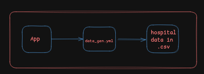

# Health Synth

#Hackfrost2024 Hackathon Project, sponsored  by [kestra](https://kestra.io/) and organised  by [wemakedevs](https://www.wemakedevs.org/)

The healthcare industry is one of the most critical sectors in society, yet it faces numerous challenges when it comes to efficiency, data management, and patient satisfaction. The primary motivation behind Health Synth is to address these challenges by leveraging technology to bridge the gaps in communication, streamline operations, and empower patients and healthcare providers alike.

- **Fragmented Healthcare Data**: Patients, doctors, clinics, and appointment information often exist in siloed systems, making it challenging to access or analyze comprehensively.
- **Delayed Communication**: Notifications and reminders for patients or medical staff are often inconsistent, leading to missed appointments or uncoordinated care.
- **Lack of Feedback Loops**: Patients frequently lack a reliable way to rate doctors or provide feedback, which limits continuous improvement in healthcare services.
- **Data Underutilization**: Existing healthcare data isn't effectively used for predictive analytics or actionable insights.

**How Health Synth Addresses These Issues:**

- **Unified Data Management**: Health Synth consolidates patients, doctors, clinics, and appointments into a single ecosystem, ensuring seamless access and efficient data flow.
- **Automated Notifications**: Integrated systems send real-time backend notifications (e.g., via Telegram), ensuring that stakeholders are always informed about updates, reminders, or critical alerts.
- **Feedback and Ratings System**: A dedicated module for doctor ratings helps maintain service quality and transparency.

--------
### **Generate Data:**



The `data_gen.yml` workflow is a critical component of the Health Synth system, designed to generate synthetic healthcare data in **CSV format** for entities such as patients, doctors, clinics, and appointments. This data is generated using a Go-based script and is vital for powering analytics, reporting, and other automation features of the Health Synth platform.

```yml
tasks:
  - id: go_script
    type: io.kestra.plugin.scripts.shell.Commands
    taskRunner:
      type: io.kestra.plugin.scripts.runner.docker.Docker
    containerImage: golang:latest
    namespaceFiles:
      enabled: true
    warningOnStdErr: false
    beforeCommands:
      - go mod init data_gen || true
    commands:
      - go run ./code/data_gen.go -generate-patients
    outputFiles:
      - '*.csv'
```
